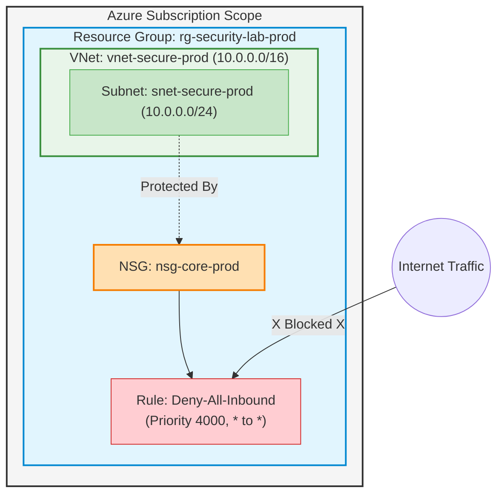

# Enterprise Azure Cloud Security Labs

An end-to-end cloud security architecture built entirely using **Azure Bicep (Infrastructure as Code)**. This repository demonstrates modern cloud engineering principles, zero-trust network segmentation, identity governance, and automated vulnerability tracking.

##   Architecture and Blueprint
This project simulates a secure hybrid enterprise environment.

* **Hub-and-Spoke Network Topology:** Completely isolates backend compute resources from the public internet.
* **Default-Deny Perimeter Security:** Network Security Groups (NSGs) explicitly drop all unauthenicated inbound traffic.
* **Hybrid Identity Lifecycle:** Outlines the core framework for secure Active Directory to Microsoft Entra ID integration.

### Infrastructure Components
* **Resource Group:** `rg-security-lab-prod`
* **Virtual Network:** `vnet-secure-prod` (Address Space: `10.0.0.0/16`)
* **Core Subnet:** `snet-secure-prod` (`10.0.1.0/24`) bound to a zero-trust NSG.